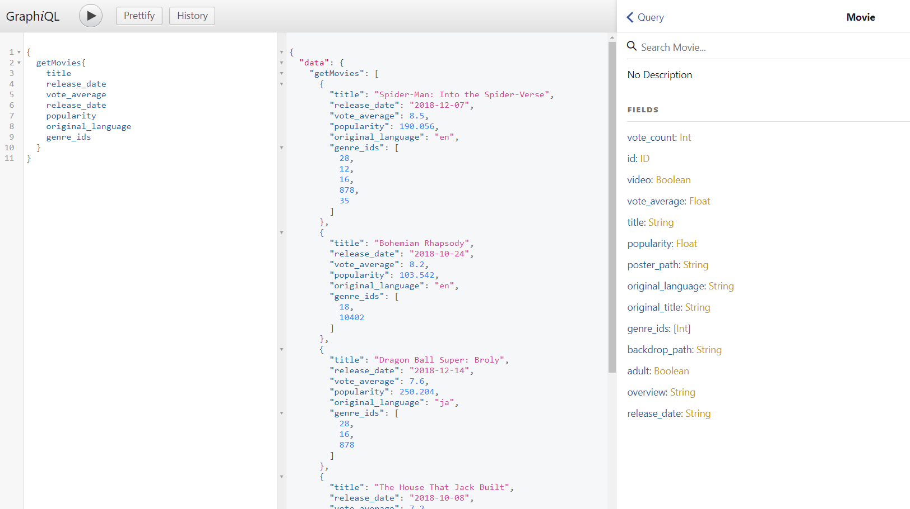

## About

GraphQL back-end application that gets latest movies data from The Movie DB API, sorted by average vote.
You need your own API key from TMDb (https://www.themoviedb.org/).

## Installation

```
npm install    //to install dependencies
npm start      //to start the server (port 8800)
```

## Img


